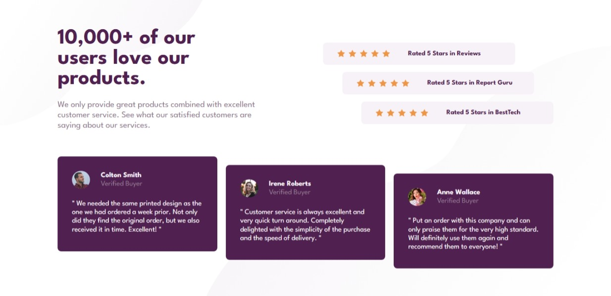

# Frontend Mentor - Social proof section solution

This is a solution to the [Social proof section challenge on Frontend Mentor](https://www.frontendmentor.io/challenges/social-proof-section-6e0qTv_bA). Frontend Mentor challenges help you improve your coding skills by building realistic projects.

## Table of contents

- [Overview](#overview)
  - [The challenge](#the-challenge)
  - [Screenshot](#screenshot)
  - [Links](#links)
- [My process](#my-process)
  - [Built with](#built-with)
  - [What I learned](#what-i-learned)
  - [Continued development](#continued-development)
- [Author](#author)

## Overview

### The challenge

Users should be able to:

- View the optimal layout for the section depending on their device's screen size

### Screenshot

### Links

- Solution URL: [GitHub Repository](https://github.com/Innocent-Leo/social-proof-section.git)
- Live Site URL: [Live Demo](https://fm-social-proof-section-main.netlify.app/)

## My process

### Built with

- Semantic HTML5 markup
- CSS custom properties
- Flexbox
- CSS Grid
- Mobile-first workflow

### What I learned

This challenge helped me:

- Combine **CSS Grid and Flexbox** to structure cards and stats
- Work with **text alignment and spacing** for better readability
- Improve handling of responsive layouts where elements **reorder or stack**
- Use consistent **visual hierarchy** with font sizing, weights, and spacing

### Continued development

I’d like to continue improving by:

- Exploring **fluid typography** using `clamp()`
- Testing accessibility for screen readers
- Refactoring styles into reusable utility classes

## Author

- Frontend Mentor - [@Innocent-Leo](https://www.frontendmentor.io/profile/Innocent-Leo)
- LinkedIn - [@Innocent-Okeke](https://www.linkedin.com/in/innocentokeke)
- Twitter - [@itz_saintleo](https://www.twitter.com/itz_saintleo)
